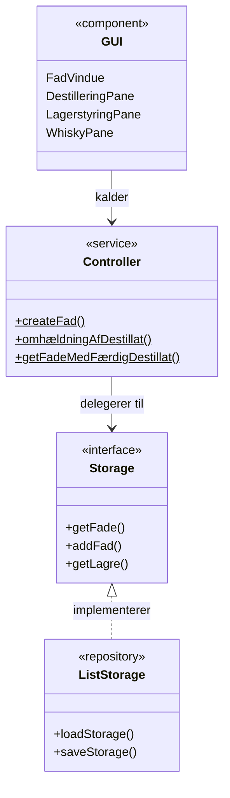
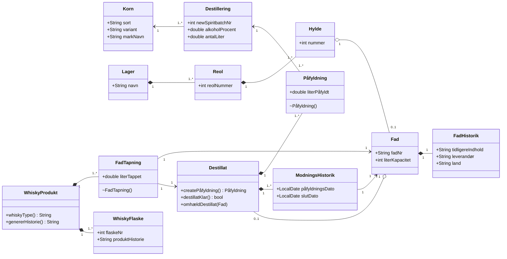
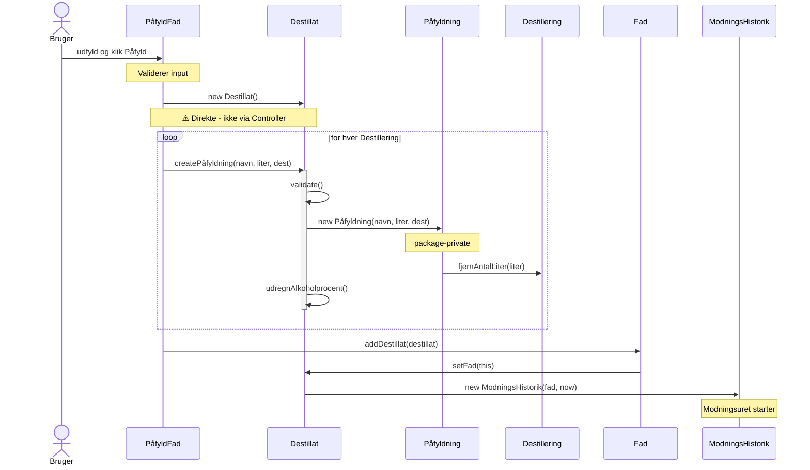
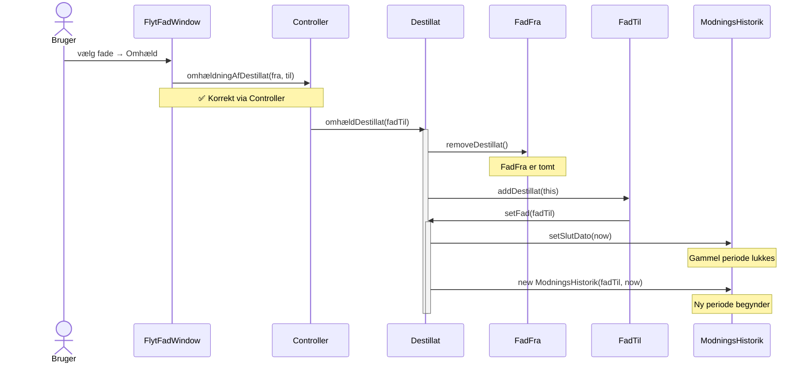

# Diagrams

Mermaid sources for the rendered diagrams in [`diagrams/`](diagrams/).
To regenerate, paste a block into https://mermaid.live and export it as PNG.

---

## 1. Arkitektur — `diagrams/arch.png`

---

## 2. Domænemodel — `diagrams/domain.png`

---

## 3. Sekvensdiagram: Påfyldning — `diagrams/seq-paafyldning.png`

---

## 4. Sekvensdiagram: Omhældning — `diagrams/seq-omhaeldning.png`

