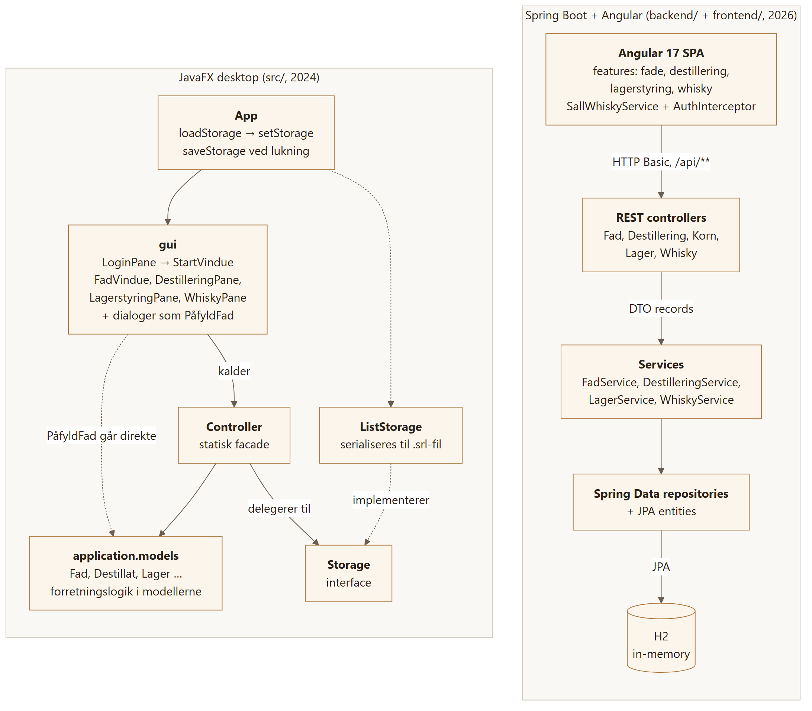
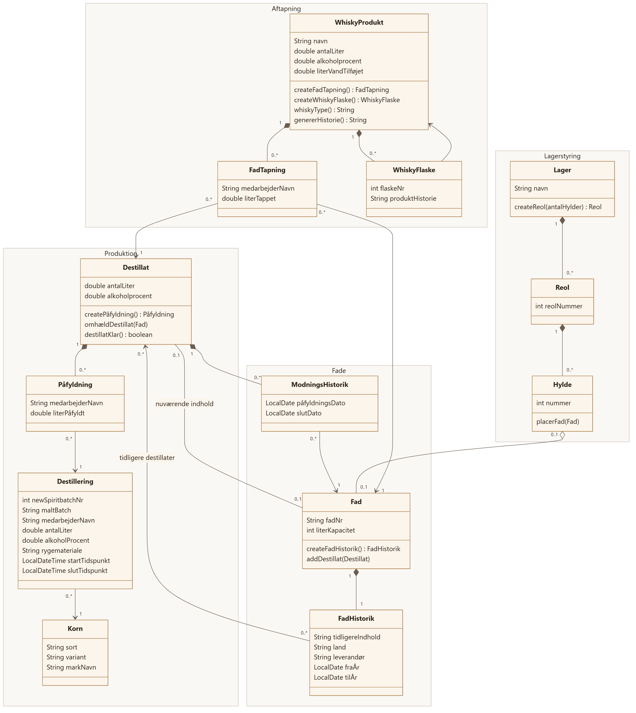
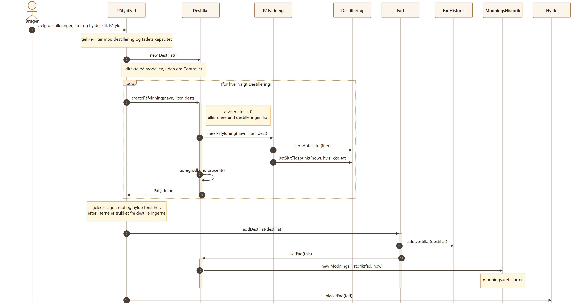
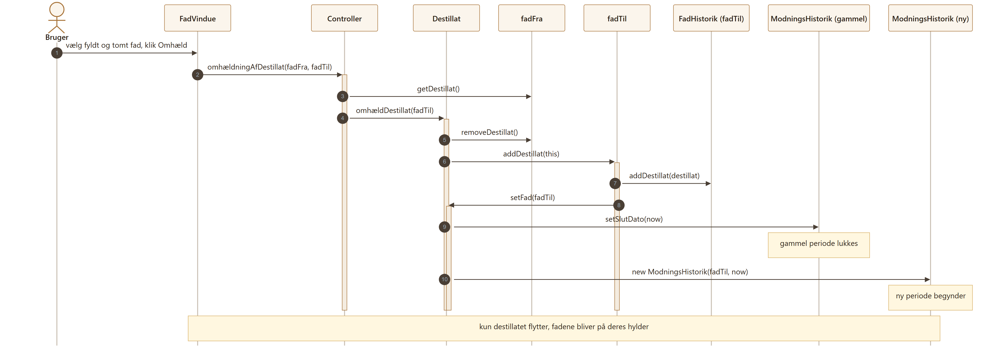

# Diagrams

The PNGs in [`diagrams/`](diagrams/) are rendered from the Mermaid sources next to them (`*.mmd`), with one shared theme in `diagrams/mermaid.config.json`. To regenerate all four after editing a source:

```sh
sh diagrams/render.sh
```

It runs `@mermaid-js/mermaid-cli` through `npx`, so Node is the only requirement. I render to PNG on a white background rather than SVG, because GitHub strips the HTML labels Mermaid puts in its SVGs.

The architecture diagram covers both versions of the app. The domain model and the two sequence diagrams describe the JavaFX version (`src/`), where the business logic lives in the model classes. In the Spring Boot rewrite the same flows sit in `FadService`, and `FadHistorik` is folded into the `Fad` entity.

---

## 1. Architecture

Source: [`diagrams/arch.mmd`](diagrams/arch.mmd)



On the JavaFX side the GUI talks to a static `Controller`, which delegates persistence to the `Storage` interface. `ListStorage` implements it and serializes everything to a `.srl` file on exit. The dashed arrow from the GUI to the models is `PåfyldFad`, which builds the `Destillat` itself instead of going through the `Controller`.

## 2. Domain model

Source: [`diagrams/domain.mmd`](diagrams/domain.mmd)



Classes are grouped by area: production, barrels, warehouse and bottling. Each class shows its fields plus the factory and domain methods that matter, not getters and setters. Multiplicities are what the constructors guarantee, so a fresh `Lager` has `0..*` racks, not `1..*`.

## 3. Sequence: filling a barrel (påfyldning)

Source: [`diagrams/seq-paafyldning.mmd`](diagrams/seq-paafyldning.mmd)



`PåfyldFad.PåfyldAction()` creates the `Destillat` and one `Påfyldning` per chosen distillation, then puts the destillat in the barrel and the barrel on a shelf. The warehouse, rack and shelf are only checked after the liters have been taken from the distillations, so a missing shelf leaves those liters gone.

## 4. Sequence: re-casking (omhældning)

Source: [`diagrams/seq-omhaeldning.mmd`](diagrams/seq-omhaeldning.mmd)



`FadVindue` sends the full and the empty barrel to `Controller.omhældningAfDestillat()`. The destillat closes its current `ModningsHistorik` period and opens a new one for the new barrel, so the whole ageing history is kept.
